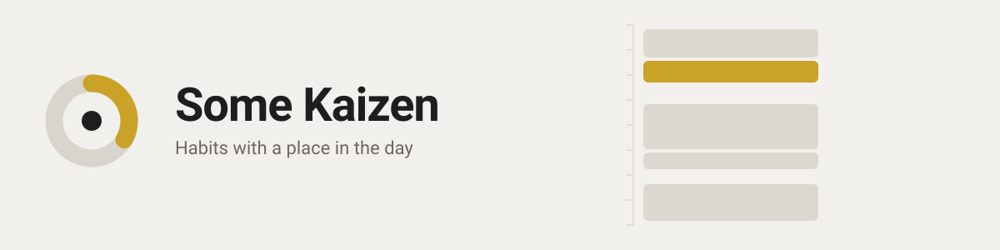

<picture>
  <source media="(prefers-color-scheme: dark)" srcset="docs/assets/banner-dark.svg" />
  
</picture>

# Some Kaizen

A mobile-first habit tracker that gives habits a place in the day rather than a checkbox in
a list. Fully offline, stored on the device, packaged for Android with Capacitor.

## What it does

- **Three kinds of habit**, modelled as three separate shapes so an impossible combination
  cannot be represented.
  - _Did it_ — binary. You meditated or you did not.
  - _Measured_ — carries a unit, a minimum and a goal. Reaching the minimum grades as a
    partial day, because a day where you drank most of your water is not the same as a day
    where you drank none.
  - Each positive habit either **counts its times** ("3 times a week", leaving which days
    open for the planner to settle) or **names its days** ("Mon, Wed, Fri", already settled,
    so those days owe it without anyone dragging a card). The repetition count of a named
    schedule is derived from the days rather than stored beside them.
  - _Quitting_ — never planned and never performed. Each finished day is judged the
    following morning, which is the only moment the answer is actually known.
- **Planning in two gestures.** Drag an occurrence onto a day in the weekly board, then drag
  it onto an hour in the day timeline. An occurrence that never gets the second gesture is
  valid and simply happens sometime that day. Once placed, a grip on the card's lower edge
  drags its length. The marker beside each card in the hour column opens the exact times,
  either as a start and an end or as a start and a length. Stretching the ruler is the same
  control as the step a drag lands on — 30, 15 or 5 minutes — because a step has to stay
  large enough to aim at.
- **Block time** — sleep, work, and anything else immovable. Blocks may never overlap each
  other; habits may overlap them freely, because reading during a commute is a real plan.
- **Statistics** per habit and overall, including a six-month heatmap.
- **Reminders** on scheduled occurrences, delivered by the system on Android.
- **Android's back button** closes whatever is open before it touches the route, and leaves
  the app from the screen it started on.
- **Backup** to a single JSON file. Importing one *merges* rather than replaces: a backup is
  usually the other half of your data, so it brings what is missing, keeps what is here when
  the two disagree, and shows every collision before writing anything.

## Running it

```sh
bun install          # once, at the root: one lockfile for the whole workspace
bun run dev          # the tracker, http://localhost:5173
bun run landing:dev  # the site, http://localhost:4321
```

Every script at the root delegates into the app it belongs to, so `bun run test:unit` here and
`bun run test:unit` inside `apps/tracker` are the same run. Anything the tracker alone has —
`dev:phone`, the Android tasks — is run from `apps/tracker`.

Opening the app over a plain LAN address is not a secure context, so anything relying on one
will not work there. That is a real constraint rather than a quirk: it is why identifiers are
minted through `uuid` instead of `crypto.randomUUID`, which does not exist outside a secure
context and broke every screen the first time this was tried on a phone.

## Checks

```sh
bun run test:unit    # vitest
bun run type-check   # vue-tsc
bun run lint         # oxlint and eslint
```

Run the type check separately from the tests. Vitest transpiles without checking types, so a
green test run has already hidden real type errors here more than once.

## Android

Requires the Android SDK and a JDK. Both `JAVA_HOME` and `ANDROID_SDK_ROOT` must be set; the
build is known to work on JDK 21 and JDK 24.

```sh
bun run android:apk       # build the web app, sync, and assemble a debug APK
bun run android:install   # adb install the result
```

The launcher icon and the splash screens are native resources, not the favicon: `cap sync`
copies the web build and never touches them, which is why a fresh Capacitor project ships
its own icon until someone replaces it. The sources live in `apps/tracker/assets/`, and the whole set of
densities is regenerated from them with

```sh
bunx capacitor-assets generate --android
```

The splash is hidden by the app once storage is open and the first screen has rendered,
with a three second auto-hide behind it as a dead man's switch. A timed splash would either
lie about being ready or waste the time it was given.

The app asks for notification permission the first time a reminder is actually set, never on
launch, and asks for no storage permission at all: exporting writes into the app's own cache
directory and hands the file to the system share sheet, while importing uses a file input,
which already opens the system document picker inside the WebView.

## How it is put together

Hexagonal, with each feature owning its own slice.

A workspace with one app per thing that ships.

```
apps/tracker/          the habit tracker: Vue, Capacitor, IndexedDB
apps/landing/          the site: Astro, static, no server
```

**The domain has two consumers.** The site's tools run on the tracker's own rules — the same
statistics windows, the same weekday breakdown, the same challenge progress — read straight
out of `apps/tracker/src` through aliases in the site's config. There is one copy, because two
would be two truths that drift apart in silence and the one with the bug fixed would be
whichever somebody happened to remember.

The reach is deliberately narrow: only `*/domain/**` is aliased, never `application` or `ui`,
so the site cannot import a Vue component and find out at build time. It does not resolve at
all, which is the difference between a boundary and a note asking people to be careful.

The cost of reading across is that moving a domain file could break the site quietly, so
`bun run build` at the root builds **both**. A reorder that breaks the site turns the build
red in the same run that made it.

Inside the tracker, hexagonal, with each feature owning its own slice.

```
src/
  shared/domain/       value objects: dates, times, colours, identifiers
  shared/ui/           components, gestures, feedback
  shared/infrastructure/idb/
  modules/<feature>/
    domain/            pure rules, no framework
    application/       queries and mutations over the ports
    infrastructure/    adapters
    ui/                components owned by the feature
  core/                composition root: persistence, platform, router
  pages/               file-based routes
```

The domain never learns that IndexedDB, Vue or Capacitor exist. Only `src/core` knows both a
port and its adapter, which is what makes the planned sync a second adapter rather than a
rewrite of everything that touches data.

### Decisions worth knowing before changing things

**Dates are `YYYY-MM-DD`, not `Date`.** A habit is performed on a day the user lived, not at
an instant on a global timeline. "Did I drink my water on Tuesday" must stay Tuesday whether
it was logged at 07:00 or 23:59, and must survive a daylight saving change. All arithmetic
runs through UTC internally, where days are exactly 24 hours long.

**Times are minutes from midnight, and a span is a start plus a duration.** Sleep from 23:00
to 07:00 written as two clock times looks like a backwards, empty range. Written as a
duration it stays unambiguous, and overlap is computed by flattening each span onto the days
it actually covers — which is how Sunday night correctly collides with a Monday morning
alarm.

**Occurrences are stamped with a period key.** "Twice a week" only means something once you
fix which week. Counting by key rather than by scanning dates keeps the week spanning New
Year as one week instead of two half quotas.

**Entries belong to an occurrence and carry `recordedAt`.** Storage returns rows keyed by
identifier, which for a UUID is random order, so "the last one in the list" is not "the last
one written". A correction replaces the answer rather than stacking beside it.

**Deletes leave tombstones, and the tombstone keeps nothing.** A deletion that leaves no
trace is indistinguishable from a record another device has never seen, so the first sync
would resurrect everything you ever deleted. What survives is the identifier and the moment,
never the value: deleting a habit called "quit drinking" has to remove that text from the
device. Replacing the whole dataset buries what it removes for the same reason.

**Timestamps come from a clock that cannot go backwards.** A wall clock steps back on a
timezone change or an NTP correction, and when it does, an edit made later gets the smaller
number and every rule that asks "which is newer" picks the wrong one. The clock is seeded
above whatever is already on disk, because a counter that resets on launch is undone by
exactly the event it exists to survive.

**Backups are rebuilt through the domain's own constructors.** An imported file is untrusted
and is rejected whole rather than trusted into storage, where a single bad field would
surface later as a broken screen far from the import.

**Foreground colour is computed, not chosen.** A fixed white label reads perfectly on a deep
blue and turns invisible on a pale yellow, so the ink with the higher contrast wins. Patterns
exist alongside colour because colour alone excludes anyone who cannot separate red from
green, and disappears in greyscale.

## The banner

`docs/assets/banner-*.svg`, written from the brief in `docs/prompts/banner.md`. SVG rather
than a rendered image because a README header is read at every width from a phone to a wide
monitor, and because the mark in it is the same handful of shapes as the favicon rather than
a picture of them.

Two files rather than one, swapped by `<picture>` on colour scheme: a warm off-white banner
on a dark README is a lit rectangle in the middle of the page.

Nothing in them may reference anything external — no webfont, no embedded image, no script.
GitHub sanitises SVG it renders, so a banner that reaches outside itself is a banner that
arrives broken.

## Licence

Private project.
